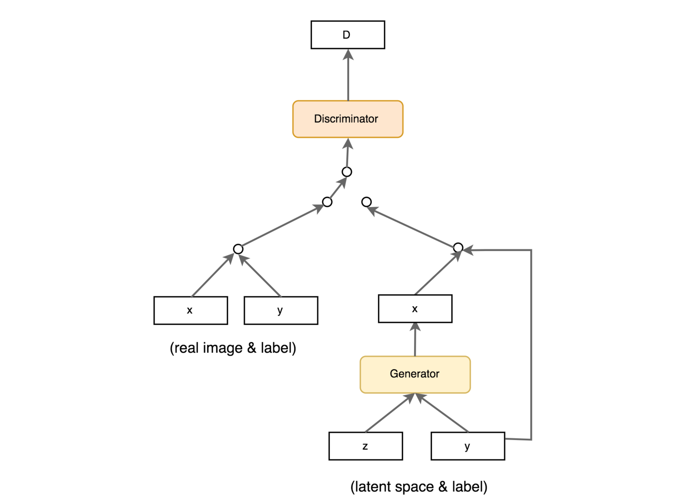
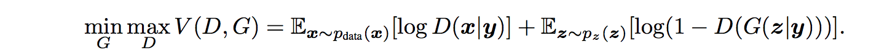

本文分两个部分：
1. GAN与cGAN介绍以及实现策略
2. 利用cGAN生成动漫人物图像的PyTorch代码实现

---


## GAN与cGAN


生成对抗网络（简称GAN）是用于训练基于深度学习的生成模型的体系结构。
该体系结构由生成器和鉴别器模型组成。 生成器模型负责生成新的合理示例，这些示例在理想情况下与数据集中的真实示例是无法区分的。 鉴别器模型负责将给定图像分类为真实图像（从数据集中提取）或伪图像（生成）。

以零和或对抗的方式一起训练模型，以使得鉴别器的改进以降低生成器的能力为代价，反之亦然。


GAN在图像合成方面很有效，也就是说，可以为目标数据集生成图像的新示例。 一些数据集具有其他信息，例如类标签，因此希望利用此信息。

例如，MNIST手写数字数据集具有相应整数的类别标签，CIFAR-10小对象照片数据集具有照片中相应对象的类别标签，而Fashion-MNIST服装数据集具有针对以下项的相应项的类别标签服装。

尽管GAN模型能够为给定的数据集生成新的随机合理示例，但是除了试图弄清楚输入到生成器的潜在空间与生成的图像之间的复杂关系之外，没有其他方法可以控制生成的图像的类型。 。

在GAN模型中使用类标签信息有两种动机：
* 改善GAN
* 目标图像生成

与输入图像相关的其他信息（例如类别标签）可用于改善GAN。 这种改进可以采用更稳定的训练，更快的训练和/或生成的图像具有更好的质量的形式。

类标签还可以用于故意或有针对性地生成给定类型的图像。

GAN模型的局限性在于它可能会从域中生成随机图像。 潜在空间中的点与生成的图像之间存在关系，但是这种关系复杂且难以映射。

或者，可以通过一种方式训练GAN，使得生成器模型和鉴别器模型都以类别标签为条件。 这意味着当将训练后的生成器模型用作独立模型来生成域中的图像时，可以生成给定类型或类标签的图像。

条件生成对抗网络（简称cGAN）是一种GAN类型，它涉及通过生成器模型有条件地生成图像。 图像生成可以取决于类标签（如果有），条件是允许目标生成给定类型的图像。其结构如下图：




## Conditional Generative Adversarial Networks

>"Generative adversarial nets can be extended to a conditional model if both the generator and discriminator are conditioned on some extra information y. […] We can perform the conditioning by feeding y into the both the discriminator and generator as additional input layer."

— [Conditional Generative Adversarial Nets](https://arxiv.org/abs/1411.1784), 2014.

cGAN目标函数：


### 原理
cGAN理解起来其实很容易，与GAN在原理上的区别在于：
* 判别器和生成器的输入中新加入了类别的条件信息。
* 判别器除了根据输入图像的真实性，还要判断图像与label信息是否匹配给出综合的分数，这样才能使生成器生成的图片既真实，又和类别信息匹配。
* 生成器需要根据随机变量z和类别信息y生成对应图像

### 作者在实现上的策略
判别器：
* 原来的判别器$D(Img_x)$根据输入图片给出0~1之间的分数；现在判别器D(Img_x,label)根据输入图片和label给出0~1之间的分数。
* 原来的判别器$D(Img_x)$的loss在计算时由两部分构成，分别是输入真实图片，输出与1之间的损失和输入生成图片，输出与0之间的损失。
* 现在的判别器$D(Img_x,label)$的loss由三部分构成，分别是：
    1. 输入真实图片和真实label，输出与1之间的损失
    2. 输入生成图片和真实label，输出与0之间的损失
    3. 输入真实图片和错误label，输出与0之间的损失

*这里作者将label信息进行onehot编码后，添加一个由label定长向量到图片面积大小（96\*96）向量的全连接层，将其与图片（3\*96\*96）拼接形成（4\*96\*96）的输入，目的是可以保持使用GAN的卷积神经网络进行后续处理。*


生成器：
* 原来的生成器$G(z)$根据正态噪声生成一张rgb的图片，其损失为$D(G(z))$与1之间的损失，为了最小化损失，生成器必须生成越来越逼真的图片来在判别器D处取得更高的分数
* 现在的生成器$G(z,label)$根据正态噪声和$label$信息生成一张图片，其损失为$D(G(z,label),label)$与1之间的损失，为了最小化损失，生成器必须生成越来越**逼真**的图片并且与label**相符**的图片来在判别器D处取得更高的分数。

*这里作者将label信息进行onehot编码后当做一段定长的向量与随机噪声进行拼接形成新的输入，目的是不改变生成器原有的结构。*

---

## 代码实现
完整代码已上传至[🤚Github](https://github.com/chenllliang/CGAN)。

作者在实现cGAN代码时遇到的主要问题是如何label标签与图片结合。

首先是模型的建立使用model.py
```python
import torch.nn as nn
import torch

class CNN_Generator(nn.Module):
    def __init__(self,noize_dim,label_dim,num_feature):  
        super(CNN_Generator, self).__init__()   
        #第一层全连接，首先将噪声和标签信息拼接，映射成一个高维的向量    
        self.fc = nn.Linear(noize_dim+label_dim,num_feature)    
				# batch, 15*192*192    

        self.br = nn.Sequential(    
            nn.BatchNorm2d(15),    
            nn.ReLU(True)   
        )
        self.downsample1 = nn.Sequential(  
            nn.Conv2d(15, 50, 3, stride=1, padding=1),  
            # batch, 50, 192, 192  
            nn.BatchNorm2d(50),  
            nn.ReLU(True)  
        )
        self.downsample2 = nn.Sequential(  
            nn.Conv2d(50, 25, 3, stride=1, padding=1),  
            # batch, 25, 192, 192  
            nn.BatchNorm2d(25),  
            nn.ReLU(True)  
        )
        self.downsample3 = nn.Sequential(  
            nn.Conv2d(25, 3, 2, stride=2),  
            # batch, 3, 96, 96  
            nn.Tanh()  
        )

    def forward(self, x):  
        x = self.fc(x)  
        x = x.view(x.size(0), 15, 192, 192)  
        x = self.br(x)  
        x = self.downsample1(x)  
        x = self.downsample2(x)  
        x = self.downsample3(x)  
        return x  


class CNN_Discriminator(nn.Module):  
    def __init__(self,label_dim):  
        super(CNN_Discriminator, self).__init__()  

        self.label_embedding = nn.Linear(label_dim,96*96) #全连接层

        self.conv1 = nn.Sequential(  
            nn.Conv2d(in_channels=4, out_channels=32, kernel_size=5, padding=2),  # batch, 32, 96，96,  
            nn.LeakyReLU(0.2, True),  
            nn.AvgPool2d(2, stride=2),  # batch, 32, 48, 48  
        )
        self.conv2 = nn.Sequential(
            nn.Conv2d(32, 64, 5, padding=2),  # batch, 64, 48, 48  
            nn.LeakyReLU(0.2, True),  
            nn.AvgPool2d(2, stride=3)  # batch, 64, 16, 16  
        )
        self.fc = nn.Sequential(
            nn.Linear(64 * 16 * 16, 1024),  
            nn.LeakyReLU(0.2, True),  
            nn.Linear(1024, 1),  
            nn.Sigmoid()  
        )

    def forward(self, x, label):  
        '''
        x: batch, width, height, channel=3

        '''
        label = self.label_embedding(label).view(-1,1,96,96)  
        x = torch.cat([x,label],1)  
        x = self.conv1(x)  
        x = self.conv2(x)  
        x = x.view(x.size(0), -1)  
        x = self.fc(x)  
        return x

```

训练部分中的核心代码关键在三个判别器的loss上，分别是：d_loss_matched_real，d_loss_matched_fake，d_loss_unmatched_real
和生成器的loss：g_loss
```python
for epoch in range(num_epoch):
	for i, (img,_) in enumerate(dataloader):

		if (i+1)*batch_size < num_samples:  
			batch_vectors=torch.cat((label_vectors[i*batch_size:(i+1)*batch_size]),0)  
			batch_vectors=batch_vectors.view(-1,32).float()  
		else:
			batch_vectors=torch.cat((label_vectors[i*batch_size:-1]),0)  
			batch_vectors=batch_vectors.view(-1,32).float()  
		#此处label_vectors为存储了所有真实图片标签onehot编码向量的列表  
		#batch_vectors是为了选出和这一个batch匹配的label向量  


		num_img = img.size(0)
		#train discriminator
		# compute loss of real_matched_img
		img = img.view(num_img,3,96,96)
		real_img = Variable(img).to(device)
		real_label = Variable(torch.ones(num_img)).to(device)
		fake_label = Variable(torch.zeros(num_img)).to(device)
		batch_vectors = Variable(batch_vectors).to(device)
		matched_real_out = D(img,batch_vectors)
		d_loss_matched_real = criterion(matched_real_out, real_label)
		matched_real_scores = matched_real_out  # closer to 1 means better

		# compute loss of fake_matched_img
		z = Variable(torch.randn(num_img, z_dimension)).to(device)
		z = torch.cat((z,batch_vectors),axis=1).to(device)
		fake_img = G(z)
		matched_fake_out = D(fake_img,batch_vectors)
		d_loss_matched_fake = criterion(matched_fake_out, fake_label)
		matched_fake_out_scores = matched_fake_out  # closer to 0 means better

		# compute loss of real_unmatched_img
		rand_label_vectors=random.sample(label_vectors,num_img)
		rand_batch_vectors=torch.cat((rand_label_vectors[:]),0)
		rand_batch_vectors=rand_batch_vectors.view(-1,32).float()
		#错误向量用随机选取的方式选取，由于本数据集中经过预处理后相同的图片描述很少，所以采用这一种方法


		z = Variable(torch.randn(num_img, z_dimension)).to(device)
		z = torch.cat((z,rand_batch_vectors),axis=1).to(device)
		fake_img = G(z)
		unmatched_real_out = D(fake_img,batch_vectors)
		d_loss_unmatched_real = criterion(unmatched_real_out, fake_label)
		unmatched_real_out_scores = unmatched_real_out  # closer to 0 means better

		# bp and optimize
		d_loss = d_loss_matched_real + d_loss_matched_fake + d_loss_unmatched_real
		d_optimizer.zero_grad()
		d_loss.backward()
		d_optimizer.step()

		# ===============train generator
		# compute loss of fake_img
		# compute loss of fake_matched_img
		z = Variable(torch.randn(num_img, z_dimension)).to(device)
		z = torch.cat((z,batch_vectors),axis=1).to(device)
		fake_img = G(z)
		matched_fake_out = D(fake_img,batch_vectors)
		matched_fake_out_scores = matched_fake_out

		g_loss = criterion(matched_fake_out,real_label)

		# bp and optimize
		g_optimizer.zero_grad()
		g_loss.backward()
		g_optimizer.step()
```
---

### 有待提高和值得思考的地方
1. 生成器中的噪声向量和label向量维度是否有最佳的选择
2. 判别器中是否有更好处理label和图片的方法
3. 原始数据集可能只有一小部分有label，一大部分没有label，我这里我抛弃了那些没有label的图片，这种情况下如何最大化利用资源进行目标生成。
4. 本文的label形如"blue long hair and yellow eyes", 我提取了形容词制作成的onehot编码的向量，是否可以用其他NLP方法制作向量更有普适意义。
